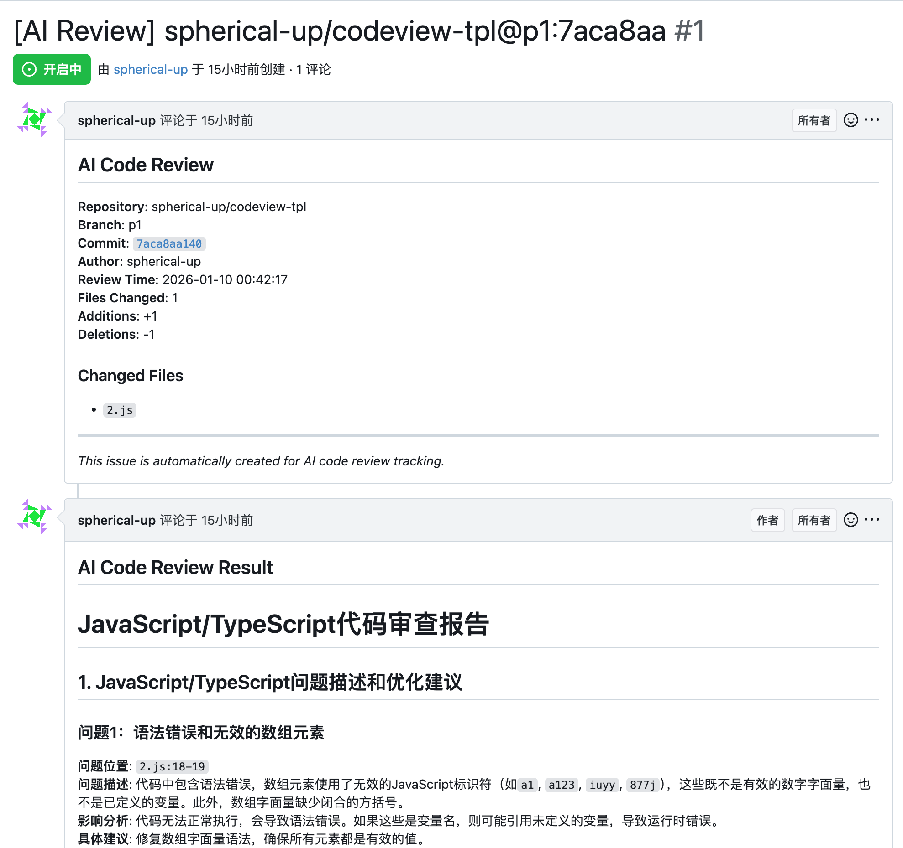
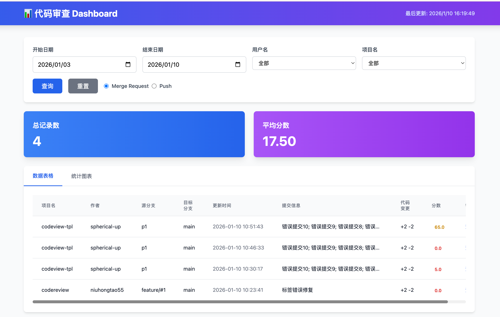
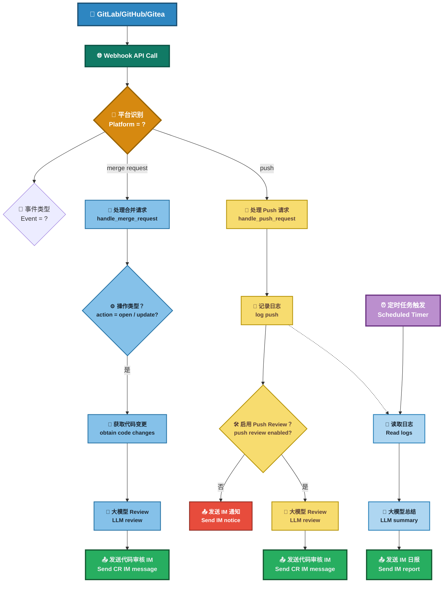

## 项目简介

本项目是一个基于大模型的自动化代码审查工具，帮助开发团队在代码合并或提交时，快速进行智能化的审查(Code Review)，提升代码质量和开发效率。

## 功能

- 🚀 多模型灵活切换
  - 全面兼容 **DeepSeek、OpenAI、通义千问** 想用哪个，用哪个！轻松上手，自由切换。
- 📢 消息实时送达
  - 审查结果 **一键推送** 到 **钉钉、企业微信、飞书**  及时响应，代码问题无所遁形！
- 📅 自动生成开发日报
  - 基于 **GitHub / GitLab / Gitea Commit** 记录，自动梳理每日开发动态：  
谁在认真敲代码，谁在划水，一清二楚 😼。
- 🔗 多平台支持
  - 全面支持 **GitLab、GitHub、Gitea** 三大主流代码托管平台，一套系统，多平台通用！
- 📊 数据可视化 Dashboard
  - 集中展示所有 **Code Review 记录**，提供清晰的：
    - 项目整体统计  
    - 成员贡献分析  
  - 数据说话，甩锅无门！
- 🎭 多种审查风格，任你挑！
  | 风格 | 描述 | 示例 |
  |------|------|------|
  | 🤵 **专业型** | 严谨细致、正式专业 | *建议优化此函数的命名，以提升可读性。* |
  | 😈 **毒舌型** | 毒舌吐槽、直击要害 | *你确定这是人能读的代码？* |
  | 🌸 **绅士型** | 温柔委婉、如沐春风 | *或许这里可以再优化一下呢~* |
  | 🤪 **幽默型** | 搞笑风趣、快乐改码 | *这段 if-else 比我相亲经历还复杂！* |


## 效果图:

### Push 推送示例


### 代码审查摘要


### GitLab 评论示例


### Gitea 评论示例



### Dashboard 数据看板



## 原理

在开发者向 **GitLab / GitHub / Gitea** 提交代码（包括 Merge Request/Pull Request 创建或 Push 操作）时，代码托管平台会根据预设的 Webhook 配置触发回调请求，调用本系统提供的接口。系统接收到事件后，将解析提交内容，并通过集成的第三方大语言模型对代码变更进行静态审查。

审查内容包括但不限于：代码规范检查、潜在错误识别、安全风险分析及可维护性建议。完成审查后，系统会将结果以评论的形式自动回写至对应的 Merge Request/Pull Request 或 Commit 页面（Gitea 还支持创建 Issue 来存储审查结果），确保审查反馈能够实时集成至开发工作流中，从而提升代码质量与团队协作效率。

**流程图**


## 部署

### 方案一：Docker 部署

**1. 准备环境文件**

- 克隆项目仓库：
```aiignore
git clone https://github.com/spherical-up/Easy-AI-CodeReview
cd Easy-AI-CodeReview
```

- 创建配置文件：
```aiignore
cp config/.env.dist config/.env
```

- 编辑 config/.env 文件，配置以下关键参数：

```bash
#大模型供应商配置,支持 openai , deepseek 和 qwen
LLM_PROVIDER=deepseek

#DeepSeek
DEEPSEEK_API_KEY={YOUR_DEEPSEEK_API_KEY}

#支持review的文件类型(未配置的文件类型不会被审查)
SUPPORTED_EXTENSIONS=.java,.py,.php,.yml,.vue,.go,.c,.cpp,.h,.js,.css,.md,.sql

#钉钉消息推送: 0不发送钉钉消息,1发送钉钉消息
DINGTALK_ENABLED=0
DINGTALK_WEBHOOK_URL={YOUR_WDINGTALK_WEBHOOK_URL}

#Gitlab配置
GITLAB_ACCESS_TOKEN={YOUR_GITLAB_ACCESS_TOKEN}
```

**2. 启动服务**

```bash
docker-compose up -d
```

**3. 验证部署**

- 主服务验证：
  - 访问 http://your-server-ip:5001
  - 显示 "The code review server is running." 说明服务启动成功。
- Dashboard 验证：
  - 访问 http://your-server-ip:5002
  - 看到一个审查日志页面，说明 Dashboard 启动成功。

### 方案二：本地Python环境部署

**1. 获取源码**

```bash
git clone https://github.com/spherical-up/Easy-AI-CodeReview
cd Easy-AI-CodeReview
```

**2. 安装依赖**

使用 Python 环境（建议使用虚拟环境 venv）安装项目依赖(Python 版本：3.10+):

```bash
pip install -r requirements.txt
```

**3. 配置环境变量**

同 Docker 部署方案中的.env 文件配置。

**4. 启动服务**

- 启动API服务：

```bash
python api.py
```

- 启动Dashboard服务：

```bash
python ui_server.py
```

**注意**：Dashboard 前端已从 Streamlit 迁移到基于 HTML + TailwindCSS + JavaScript 的实现，前端文件位于 `web/` 目录中。`ui.py` 已废弃，请使用 `ui_server.py` 启动新的前端服务。

### 配置 Webhook

#### GitLab Webhook 配置

**1. 创建Access Token**

方法一：在 GitLab 个人设置中，创建一个 Personal Access Token。

方法二：在 GitLab 项目设置中，创建Project Access Token

**2. 配置 Webhook**

在 GitLab 项目设置中，配置 Webhook：

- URL：http://your-server-ip:5001/review/webhook
- Trigger Events：勾选 Push Events 和 Merge Request Events (不要勾选其它Event)
- Secret Token：上面配置的 Access Token(可选)

**备注**

1. Token使用优先级
  - 系统优先使用 .env 文件中的 `GITLAB_ACCESS_TOKEN`。
  - 如果 .env 文件中没有配置 `GITLAB_ACCESS_TOKEN`，则使用 Webhook 传递的Secret Token。
2. 网络访问要求
  - 请确保 GitLab 能够访问本系统。
  - 若内网环境受限，建议将系统部署在外网服务器上。

#### GitHub Webhook 配置

**1. 创建Access Token**

在 GitHub 个人设置中，创建一个 Personal Access Token，需要 `repo` 权限。

**2. 配置 Webhook**

在 GitHub 项目设置中，进入 Settings → Webhooks → Add webhook：

- URL：http://your-server-ip:5001/review/webhook
- Content type：选择 `application/json`
- Events：选择 `Just the push event` 和 `Pull requests`（或选择 `Send me everything`）
- Secret：可选，用于签名验证

**3. 环境变量配置**

在 `.env` 文件中配置：

```bash
GITHUB_ACCESS_TOKEN=your_github_access_token_here
GITHUB_URL=https://api.github.com
```

#### Gitea Webhook 配置

**1. 创建Access Token**

在 Gitea 个人设置中，创建一个 Access Token，需要 `repo` 权限。

**2. 配置 Webhook**

在 Gitea 项目设置中，进入 Settings → Webhooks → Add Webhook：

- URL：http://your-server-ip:5001/review/webhook
- Content Type：选择 `application/json`
- Events：勾选 `Push` 和 `Pull Request`（或选择 `Send Everything`）
- Secret：可选，用于签名验证

**3. 环境变量配置**

在 `.env` 文件中配置：

```bash
GITEA_ACCESS_TOKEN=your_gitea_access_token_here
GITEA_URL=https://your-gitea-instance.com

# Gitea Issue 模式配置（可选）
# 是否使用 Issue 模式存储审核结果（1=启用，0=禁用，默认启用）
GITEA_USE_ISSUE_MODE=1

# Issue 标签（可选，需要先在 Gitea 中创建标签）
# GITEA_REVIEW_ISSUE_LABELS=ai-review,code-review
```

**Gitea 特殊说明**

- Gitea 支持两种审查结果存储方式：
  1. **PR/Comment 模式**：直接在 Pull Request 或 Commit 上添加评论（如果 API 支持）
  2. **Issue 模式**：创建或使用现有 Issue 来存储审查结果（推荐，更稳定可靠）
- Issue 模式的优势：
  - 可审计、可追踪、可统计
  - 支持工单化管理
  - 不依赖 Commit Comments API（某些 Gitea 版本可能不支持）

### 配置消息推送

#### 1.配置钉钉推送

- 在钉钉群中添加一个自定义机器人，获取 Webhook URL。
- 更新 .env 中的配置：
  ```
  #钉钉配置
  DINGTALK_ENABLED=1  #0不发送钉钉消息，1发送钉钉消息
  DINGTALK_WEBHOOK_URL=https://oapi.dingtalk.com/robot/send?access_token=xxx #替换为你的Webhook URL
  ```

企业微信和飞书推送配置类似，具体参见 [常见问题](docs/FAQ.md)

## 前端 Dashboard 说明

### Web 目录结构

项目的前端 Dashboard 实现位于 `web/` 目录中，采用现代化的前端技术栈：

- **技术栈**：HTML + TailwindCSS + JavaScript (原生 ES6+)
- **文件结构**：
  - `web/index.html` - 主页面，包含 Dashboard 的完整 UI 结构
  - `web/app.js` - 前端逻辑，包括数据获取、图表渲染、筛选等功能

### 前端服务

Dashboard 由 `ui_server.py` 提供，这是一个基于 Flask 的轻量级服务：

- **默认端口**：5002（可通过 `UI_PORT` 环境变量配置）
- **访问地址**：http://your-server-ip:5002
- **功能特性**：
  - 数据表格展示（支持 Merge Request 和 Push 两种类型）
  - 统计图表可视化（项目统计、人员统计等）
  - 多维度筛选（日期范围、用户名、项目名）
  - 实时数据更新

### 新旧前端对比

- **旧实现**（已废弃）：`ui.py` - 基于 Streamlit 的实现
- **新实现**（当前使用）：`web/` 目录 + `ui_server.py` - 基于 HTML/CSS/JS 的现代化实现

新实现的优势：
- 更轻量级，无需 Streamlit 依赖
- 更快的加载速度
- 更好的用户体验和界面设计
- 更容易自定义和扩展

## 配置说明

### 大模型供应商配置

项目支持多种大模型供应商，通过 `LLM_PROVIDER` 环境变量配置：

**位置**: `src/llm/factory.py`

```python
# 支持的大模型供应商
chat_model_providers = {
    'openai': lambda: OpenAIClient(),        # OpenAI
    'deepseek': lambda: DeepSeekClient(),    # DeepSeek
    'qwen': lambda: QwenClient(),           # 通义千问
}
```

### 各模型API配置

**位置**: `src/llm/client/` 目录下的各客户端文件

每个模型都有对应的API配置环境变量：

| 模型 | API密钥 | API地址 | 模型名称 |
|------|---------|---------|----------|
| **OpenAI** | `OPENAI_API_KEY` | `OPENAI_API_BASE_URL` | `OPENAI_API_MODEL` |
| **DeepSeek** | `DEEPSEEK_API_KEY` | `DEEPSEEK_API_BASE_URL` | `DEEPSEEK_API_MODEL` |
| **通义千问** | `QWEN_API_KEY` | `QWEN_API_BASE_URL` | `QWEN_API_MODEL` |

### 代码审查提示词模板

**位置**: `config/prompt_templates.yml`

这是项目的核心关键词配置，定义了代码审查的标准化提示词：

```yaml
code_review_prompt:
  system_prompt: |-
    你是一位资深的软件开发工程师，专注于代码的规范性、功能性、安全性和稳定性。
    
    ### 代码审查目标：
    1. 功能实现的正确性与健壮性（40分）：确保代码逻辑正确，能够处理各种边界情况和异常输入
    2. 安全性与潜在风险（30分）：检查代码是否存在安全漏洞，并评估其潜在风险
    3. 是否符合最佳实践（20分）：评估代码是否遵循行业最佳实践
    4. 性能与资源利用效率（5分）：分析代码的性能表现
    5. Commits信息的清晰性与准确性（5分）：检查提交信息是否清晰、准确
```

### 审查风格配置

**位置**: `src/utils/code_reviewer.py`

通过 `REVIEW_STYLE` 环境变量控制审查风格：

- **`professional`**: 专业严谨风格 - 使用标准的工程术语，保持专业严谨
- **`sarcastic`**: 讽刺性语言风格 - 大胆使用讽刺性语言，但要确保技术指正准确
- **`gentle`**: 温和建议风格 - 多用"建议"、"可以考虑"等温和措辞
- **`humorous`**: 幽默风格 - 在技术点评中加入适当幽默元素和Emoji

### 文件类型过滤配置

**位置**: `src/gitlab/webhook_handler.py`, `src/github/webhook_handler.py`

通过 `SUPPORTED_EXTENSIONS` 环境变量控制哪些文件类型会被审查：

```bash
SUPPORTED_EXTENSIONS=.java,.py,.php,.yml,.vue,.go,.c,.cpp,.h,.js,.css,.md,.sql
```

### Token限制配置

**位置**: `src/utils/code_reviewer.py`

通过 `REVIEW_MAX_TOKENS` 环境变量控制发送给大模型的文本长度：

```python
review_max_tokens = int(os.getenv("REVIEW_MAX_TOKENS", 10000))
```

### 功能开关配置

- **`PUSH_REVIEW_ENABLED`**: 是否启用Push事件审查
- **`MERGE_REVIEW_ONLY_PROTECTED_BRANCHES_ENABLED`**: 是否仅对受保护分支进行审查

### 详细审查模式配置

**位置**: `config/prompt_templates.yml`, `src/utils/code_reviewer.py`

#### 智能语言检测

系统会自动检测代码的主要编程语言，并选择相应的专业审查提示词：

- **Python代码**: 使用 `python_review_prompt`，重点关注PEP 8规范、类型提示、异常处理等
- **JavaScript/TypeScript代码**: 使用 `javascript_review_prompt`，重点关注ES6+特性、类型安全、异步处理等
- **Vue3代码**: 使用 `vue3_review_prompt`，重点关注Composition API、性能优化、TypeScript集成等
- **Java代码**: 使用 `java_review_prompt`，重点关注设计模式、异常处理、线程安全等
- **其他语言**: 使用通用 `code_review_prompt`

#### Vue3专门审查功能

**Vue3检测机制**：
- 自动识别Vue文件（.vue扩展名）
- 检测Vue3特有语法特征（setup()、defineProps、ref()、reactive()等）
- 智能选择Vue3专用审查提示词

**Vue3审查维度**：
1. **Composition API使用**：响应式数据、生命周期钩子、组合函数、响应式解构
2. **模板语法和指令**：v-if vs v-show、v-for优化、事件处理、双向绑定
3. **组件设计**：Props定义、Emits定义、组件通信、组件拆分
4. **性能优化**：响应式优化、计算属性、异步组件、虚拟滚动
5. **TypeScript集成**：类型定义、泛型使用、接口定义
6. **状态管理**：Pinia使用、状态设计、持久化
7. **路由和导航**：路由守卫、路由懒加载、路由参数
8. **错误处理和调试**：错误边界、调试工具、错误日志
9. **样式和UI**：CSS作用域、CSS变量、响应式设计
10. **测试和文档**：单元测试、文档注释、README

#### 详细审查维度

每个审查都会从以下维度进行详细分析：

**代码质量检查**:
- 命名规范：变量、函数、类名是否清晰、有意义、符合语言规范
- 代码结构：函数长度、复杂度、嵌套层级是否合理
- 注释质量：是否有必要的注释，注释是否准确、有用
- 代码重复：是否存在重复代码，是否可以通过重构优化

**安全性检查**:
- 输入验证：是否正确验证和清理用户输入
- SQL注入防护：是否使用参数化查询或ORM
- XSS防护：是否正确转义输出内容
- 权限控制：是否正确检查用户权限
- 敏感信息：是否暴露了敏感信息（密码、密钥等）

**性能优化**:
- 算法效率：是否存在性能瓶颈，时间复杂度是否合理
- 资源管理：是否正确管理内存、数据库连接等资源
- 缓存使用：是否合理使用缓存机制
- 数据库查询：查询是否优化，是否避免N+1问题

**错误处理**:
- 异常处理：是否正确处理异常情况
- 边界条件：是否考虑了各种边界情况
- 错误信息：错误信息是否清晰、有用
- 日志记录：是否记录了必要的日志信息

**可维护性**:
- 模块化：代码是否模块化，职责是否清晰
- 可测试性：代码是否易于测试
- 可扩展性：代码是否易于扩展和修改
- 文档完整性：是否有必要的文档说明

#### 输出格式要求

审查报告会包含以下详细内容：

1. **问题描述和优化建议**: 问题位置、问题描述、影响分析、具体建议、优先级
2. **代码示例**: 修改前代码、修改后代码、修改说明
3. **评分明细**: 具体分数、扣分原因、改进建议
4. **总结**: 主要问题、改进重点、总分

### 专项审查提示词

#### 1. 目录结构审查

**位置**: `src/cmd/functions/directory.py`

审查目录结构的组织逻辑、命名规范性、模块化程度、可维护性等。

#### 2. MySQL数据库审查

**位置**: `src/cmd/functions/mysql.py`

从表结构设计、字段类型、索引设计、表关系建模、性能与容量规划、安全性、可维护性与扩展性等角度进行审查。

#### 3. 分支审查

**位置**: `src/cmd/functions/branch.py`

审查分支命名规范、分支策略合理性、合并策略、分支生命周期等。

### 配置检查机制

**位置**: `src/utils/config_checker.py`

项目包含完整的配置检查机制，确保必要的环境变量都已正确设置。

### 环境变量配置示例

```bash
# 大模型供应商配置
LLM_PROVIDER=deepseek

# DeepSeek配置
DEEPSEEK_API_KEY=your_api_key_here
DEEPSEEK_API_BASE_URL=https://api.deepseek.com
DEEPSEEK_API_MODEL=deepseek-chat

# 审查配置
REVIEW_STYLE=professional
REVIEW_MAX_TOKENS=10000
SUPPORTED_EXTENSIONS=.java,.py,.php,.yml,.vue,.go,.c,.cpp,.h,.js,.css,.md,.sql

# 功能开关
PUSH_REVIEW_ENABLED=1
MERGE_REVIEW_ONLY_PROTECTED_BRANCHES_ENABLED=0

# GitLab配置
GITLAB_ACCESS_TOKEN=your_gitlab_token_here
GITLAB_URL=https://your-gitlab-instance.com

# GitHub配置
GITHUB_ACCESS_TOKEN=your_github_token_here
GITHUB_URL=https://api.github.com

# Gitea配置
GITEA_ACCESS_TOKEN=your_gitea_token_here
GITEA_URL=https://your-gitea-instance.com
GITEA_USE_ISSUE_MODE=1  # 是否使用Issue模式存储审查结果

# 消息推送配置
DINGTALK_ENABLED=1
DINGTALK_WEBHOOK_URL=your_dingtalk_webhook_url
```

<!-- ## 其它

**1.如何对整个代码库进行Review?**

可以通过命令行工具对整个代码库进行审查。当前功能仍在不断完善中，欢迎试用并反馈宝贵意见！具体操作如下：

```bash
python -m src.cmd.review
```

运行后，请按照命令行中的提示进行操作即可。

**2.其它问题**

参见 [常见问题](docs/FAQ.md) -->
